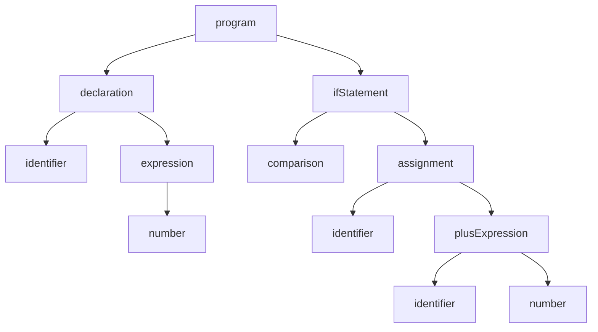

# High Level Overview
We'll just go over the image 
https://en.wikipedia.org/wiki/Computer_architecture

# Programming Languages: from text to CPU:


Take the following code:
```js
let x = 5
if(x > 3){
    x = x + 1
}
```
How does the computer see this?

## Intial Representation
```js
'l', 'e', 't', ' ', 'x', ' ', '=', ' ', '5', '\n', 'i', 'f', '(', 'x', ' ', '>', ' ', '3', ')', '{', '\n', ' ', ' ', ' ', ' ', 'x', ' ','=',' ','x',' ','+',' ','1','\n','}','\n'
```
It's just a string of characters. The computer doesn't see this of course, it sees binary:
```c
101001111101000010100011000100100000001010110010000001111000001000000011110100100000011110000010000000100000001000000010000000001010011110110010100100110011001000000011111000100000011110000010100001100110011010010000101000110101001000000011110100100000011110000010000001110100011001010110110000001010
```
Base 16 is often used instead of binary when displaying raw bytes:
```c
0x0a6c65742078203d20350a69662878203e2033297b0a2020202078203d2078202b20310a7d0a
```
A bit is 0 or 1 while a byte is 8 bits. So a byte can represent the following values:

```
dec: 0-255
hex: 0-FF
bin: 00000000-11111111
```
## Tokenization

Let's go back to our string of characters:
```js
'l', 'e', 't', ' ', 'x', ' ', '=', ' ', '5', '\n', 'i', 'f', '(', 'x', ' ', '>', ' ', '3', ')', '{', '\n', ' ', ' ', ' ', ' ', 'x', ' ','=',' ','x',' ','+',' ','1','\n','}','\n'
```
How do we know that it's `let x` and not `letx`? Because each programming language has a set of rules that let it chunk a stream of characters into groups. For example, `let` is a keyword, so l, e, and t get grouped. '5' is recognized as a number and not as an identifier. These chunks are called tokens. Once we're done **tokenizing** we went from a list of characters to a list of tokens:
```js
'let', 'x', '=', '5', 'if', '(', 'x', '>', '3', ')', '{', 'x', '=', 'x', '+', '1', '}'

```
Notice that we don't have the whitespace characters anymore (' ' and '\n') and that the letters of the keywords are chunked together.

We still can't execute these tokens, so what's next? 

## Parsing

Next we have to assign some sort of structure to the tokens. How do we know for example that the `x = x + 1` "belongs" to the if statement?
Basically we need to convert from a list to a tree. The way this is done is by **parsing**. Just like with tokenizing, we need a set of rules. Here is an example of rules that might be used to parse these tokens:

```
//Format is ruleName --> rule

variableDeclaration --> let identifier = exp
gtComparision       --> exp > exp 
ifStatement         --> if ( exp ) { statementList }
exp                 --> number | identifier
```

Once we parse the tokens according to our rules, we will get a tree that looks something like 



Let's take a look at what it looks like for real using https://astexplorer.net/

In other words, programming languages are parsed to trees just like DOM elements are

We can do a lot of stuff with this tree: type checking (for example, we are comparing x to a number, therefore x must also be a number), optimization, and most importantly, code generation.

Some languages generate **byte code** that runs on a **virtual machine**, but we'll take a look at the code that gets run directly on our computers. This language is called **assembly language** 

## Assembly

Let's look at our code snippet again:

```js
let x = 5
if(x > 3){
    x = x + 1
}
```

Let's see what assembly code a compiler might have generated for this code:

```asm
    mov rax, 5
    cmp rax, 3
    jle skip
    add rax, 1
  skip:  
```
The main things here are the mnemonics (mov, cmp, etc) and the operands (rax, 5, etc). Let's start with rax: it's a register, which is a storage unit on the CPU that can be operated upon. It's size in your computer will most likely be 64 bits (8 bytes).
Assembly has 5 main types of instructions:
 
 - Data movement
   - Get data from memory
   - Store data to memory
   - Transfer data from one register to another 
 - Arithmetic operations 
 - Bit operations
 - Comparison
   - Subtract operands and check sign of results
 - Branching
   - Conditional
     - Depends on comparison
   - Unconditional


# Memory Access
Since fast memory is more expensive, there's less of it. Because there's less of it, there's a limited amount of data we can keep in fast memory. Due to this, we have to constantly swap data in and out of memory according the needs of the currently running code. Let's say we need to fetch the value of a variable x from memory. We never get just one byte from memory; we get the additional memory location next to the location of x. The consequences of this are that if we store our data next to each other, we can often get better performance

https://dl.acm.org/doi/pdf/10.1145/1563821.1563874

And to appreciate the consequences of constantly fetching data from memory:
https://www.youtube.com/watch?v=rX0ItVEVjHc&t=1831s


# Operating System Basics

The two main jobs of an operating system are managing resources: 
  - memory
  - cpu time

and accepting and providing data to external devies:
  - keyboards
  - printers
  - wifi cards
  - monitors
Thanks to the OS, each program running can think that it has access to all memory and CPU resources on the computer, even though this isn't the case. 

## System Calls
How do we interact with the services provided by the OS? It provides an API to us called system calls. These are basically low level functions like "open a file" or "read n bytes from a file". It is rare to have to directly interact with this layer (unless you want to for fun!). Other people have written libraries that wrap these system calls into easier to use functions. One such library is libc, which in turn used when implementing other languages like Javascript and Python


